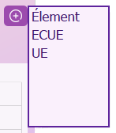

# 🗓 Projet Framework C++ : Emploi du temps
### Par Mathis CASSERT, Maeva RAMAMONJY, Anaïs BOISSON, Lou-Anne VAULOT, Marie Ndeye DIOP

*** 

Ce programme a été conçu dans le cadre d'un projet d'école, pour la création d'un logiciel de **création d'emploi du temps à destination de l'administration d'une école.**
Il répond aux différents besoins pour pouvoir créer de **manière simplifiée les EDT**, et supprimer les éléments inutiles. Il gère également les erreurs possibles que l'utilisateur peut générer, pour une utilisation logique et ergonomique.\
Les fichiers .csv énoncés dans ce readme et la base de données MySQL sont dans le dossier **"CSV"** du projet.
Les ressources graphiques sont dans le dossier **"Ressources"**.
\
\
Conseil avant le premier lancement du programme : \
✅ S'il existe, supprimer le dossier "CSV" pour une meilleure simulation.

### Créé en :

### Top contributeurs :

***

Lors du lancement du programme, la fenêtre principale apparaît. 

### Liste des éléments disponibles : 
➡️ Tableau avec toutes les informations relatives au personnel sélectionné dans le menu déroulant en haut à gauche (groupe d'étudiants ou enseignant). Par ligne, il y a le nom de l'ECUE, les étudiants/enseignant concerné(s), les heures pour chaque type de cours, et les heures totales de l'ECUE. 
\
\
➡️ En haut à droite : bouton "+" et "-", qui mènent respectivement à des fenêtres pour l'ajout ou la suppression d'un élément. 
\
\
➡️ Au centre : bouton "Mettre à jour l'emploi du temps", pour pouvoir ajouter des cours dans des créneaux. Prend en compte les heures restantes à placer selon le nombre d'heures total par type de cours. 

***

### Bouton "+" :

  
  

➕ <ins>ELEMENT</ins> : permet d'ajouter un Groupe d'étudiants (nom du groupe) / Enseignant (nom + prénom de l'enseignant) / Salle (n° et type de salle), qui seront respectivement enregistrés dans Groupes.csv / Enseignants.csv / Salles.csv. 
 
➕ <ins>ECUE</ins> : si les éléments suffisants ont été créés, permet d'ajouter une ECUE (nom + enseignant + groupe d'étudiants + types de cours de l'ECUE + heures par type de cours). L'ECUE est enregistrée dans Ecue.csv. Il faut obligatoirement au moins un groupe d'étudiants et un enseignant déjà créés.
 
➕ <ins>UE</ins> : permet d'ajouter une UE qui contient plusieurs ECUE.  Il faut obligatoirement au moins une ECUE déjà créée. ❌ _Encore en cours_ ❌
  

***

### Bouton "-" :
 

  
  

➖ <ins>GROUPE</ins> : permet de supprimer un groupe d'étudiants. Attention : si un groupe est liée à une ECUE, cette dernière sera automatiquement supprimée. Il faut obligatoirement au moins un groupe d'étudiants déjà créé.
 
➖ <ins>ENSEIGNANT</ins> : permet de supprimer un enseignant. Attention : si un enseignant est liée à une ECUE, cette dernière sera automatiquement supprimée. Il faut obligatoirement au moins un enseignant déjà créé.
 
➖ <ins>SALLE</ins> : permet de supprimer une salle (selon son numéro uniquement). Il faut obligatoirement au moins une salle déjà créée. Si une salle a été affectée à un créneau, les heures restantes à placer seront automatiquement mises à jour.
 
➖ <ins>ECUE</ins> : permet de supprimer une ECUE. Il faut obligatoirement au moins une ECUE déjà créée.
 
➖ <ins>UE</ins> : permet de supprimer une UE. Il faut obligatoirement au moins une UE déjà créée. Etant donné qu'à l'heure actuelle, il n'est pas possible d'en créer une, il est tout de même possible d'avoir accès à cette fenêtre en créant artificiellement un fichier "UE.csv". ❌ _Encore en cours_ ❌
  

***

### Bouton "Mise à jour de l'emploi du temps" : 
<!-- 
 -->
  
  <!-- 
 -->
    

      <!-- -->
      🔴 Rouge : Aucune salle n'est disponible
    

    

      <!-- -->
      🔵 Bleu : L'enseignant est déjà occupé par un autre cours
    

    

      <!-- -->
      🟢 Vert : Le groupe d'étudiants est déjà occupé par un autre cours
    

    

      <!-- -->
      ⚫ Gris : Les heures de cours sélectionnées qui seront attribuées après l'appui sur le bouton Valider
    

    

      <!-- -->
      🟣 Violet : Liste des salles libres à sélectionner
    

  <!-- 

 -->

 

🔄 Première étape : sélection du n° de la semaine, de l'ECUE concernée, et du type de cours. Appuyez sur "Valider". Le logiciel affiche l'emploi du temps avec un code couleur défini pour l'enseignant et le groupe d'étudiants. Pour chaque créneau, les salles disponibles sont affichées selon le type de cours. 
\
\
🔄 Deuxième étape : sélection des créneaux pour l'ECUE concernée. Si l'utilisateur clique sur "Enregistrer", les créneaux sont enregistrées dans la base de donnée en MySQL. Sinon, le programme revient à sa dernière sauvegarde. Les salles disponibles sont misese à jour automatiquement. 
\
\
🔄 Les heures à placer du type de cours de l'ECUE concernée sont mises à jour automatiquement dans la fenêtre principale (décrémentation). Tous les emplois du temps sont également mis à jour (étudiants et enseignant). \
